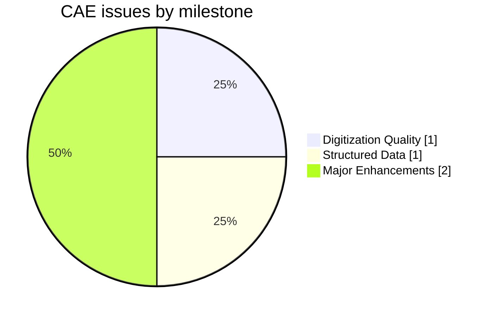
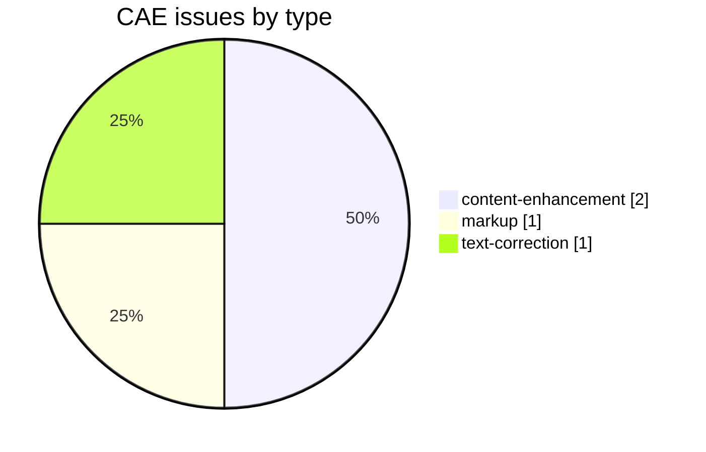
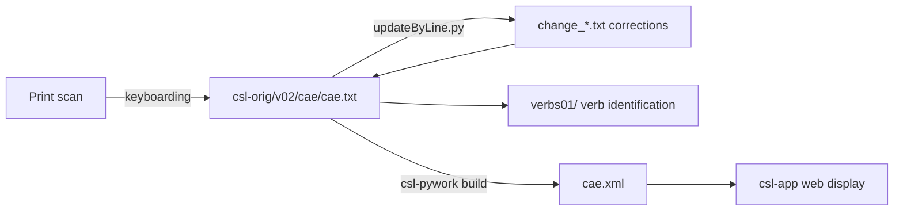

# CAE — Cappeller *A Sanskrit-English Dictionary* (1891)

_Created: 16-05-2026 · Last updated: 11-07-2026_

Development and correction repository for **Carl Cappeller's *A Sanskrit-English Dictionary, Based upon the St. Petersburg Lexicons***, a Sanskrit→English dictionary, part of the [Cologne Digital Sanskrit Lexicon](https://www.sanskrit-lexicon.uni-koeln.de/) (CDSL). The canonical source text lives in [csl-orig/v02/cae/cae.txt](https://github.com/sanskrit-lexicon/csl-orig/blob/main/v02/cae/cae.txt) (38,484 entries); this repository holds the development, correction, and enrichment work.

By the same author as CCS (the German *Sanskrit-Wörterbuch*); the two are close siblings.

## Documentation

- [CLAUDE.md](https://github.com/sanskrit-lexicon/CAE/blob/main/CLAUDE.md) — repository guide and data-format reference.
- [DATA_DICTIONARY.md](https://github.com/sanskrit-lexicon/CAE/blob/main/DATA_DICTIONARY.md) — markup tag reference.
- [CONTRIBUTING.md](https://github.com/sanskrit-lexicon/CAE/blob/main/CONTRIBUTING.md) · [CODE_OF_CONDUCT.md](https://github.com/sanskrit-lexicon/CAE/blob/main/CODE_OF_CONDUCT.md)
- Corrections to the canonical source text follow the shared [csl-orig correction workflow](https://github.com/sanskrit-lexicon/csl-corrections/blob/main/docs/correction-workflow.md).

## Contents

| Path | Purpose |
|---|---|
| [english_corrections/](https://github.com/sanskrit-lexicon/CAE/tree/main/english_corrections) | English-text correction working files |
| [verbs01/](https://github.com/sanskrit-lexicon/CAE/tree/main/verbs01) | Verb identification: maps verb entries to MW roots, with Devanāgarī renderings |
| [prefaces/](https://github.com/sanskrit-lexicon/CAE/tree/main/prefaces) | Front-matter OCR (title, dedication, preface, abbreviations) with EN + RU — see [Front matter](#front-matter-prefaces) |

## Usage example

A real entry from [csl-orig/v02/cae/cae.txt](https://github.com/sanskrit-lexicon/csl-orig/blob/main/v02/cae/cae.txt) — line 56, the "aMsala" entry:

```
56:{#aMsala/#}¦ <lex>a.</lex> strong, stout.
```

To correct the English gloss (e.g. add a missing comma-separated sense, `strong, stout` → `strong, sturdy, stout`), write a paired-line change file and apply it with `updateByLine.py`:

```
; issueNNN: add missing sense to "aMsala" gloss
56 old {#aMsala/#}¦ <lex>a.</lex> strong, stout.
56 new {#aMsala/#}¦ <lex>a.</lex> strong, sturdy, stout.
```

```sh
python updateByLine.py cae.txt change_56.txt cae_corrected.txt
```

(Illustrative — no actual defect at this line; the workflow above is exact, only the fictitious added sense is invented to demonstrate the change-file mechanics.)

## Front matter (prefaces/)

Faithful OCR + Russian translation of the dictionary's **front matter** — title, dedication (to William Dwight Whitney), the three-page Preface (signed *Jena, March 1891*), and the List of Abbreviations — from the Cologne scans. Source language is **English**, so the base per-page `.md` is the English edition and each page also has a `.ru.md`.

- Cologne source: [caepref.html](https://sanskrit-lexicon.uni-koeln.de/scans/csldev/csldoc/build/dictionaries/prefaces/caepref.html)
- Consolidated editions: [caepref_all.en.md](https://github.com/sanskrit-lexicon/CAE/blob/main/prefaces/caepref_all.en.md) · [caepref_all.ru.md](https://github.com/sanskrit-lexicon/CAE/blob/main/prefaces/caepref_all.ru.md)
- In-folder index: [prefaces/README.md](https://github.com/sanskrit-lexicon/CAE/blob/main/prefaces/README.md)

> **OCR run notes (23-06-2026).** Produced by the `/cologne-preface-ocr` skill (vision OCR + translation): 6 pages, English source + Russian. The Preface explains the scope and the `r̥`/bracket conventions; page 06 is the three-column List of Abbreviations + a symbol legend, transcribed verbatim. This dictionary's pages were completed on the main thread after background OCR agents repeatedly hit a (spurious/transient) content-filter API error on the same page — which did **not** recur on the main thread.

## Timeline

| Period | Activity |
|---|---|
| 2020 | Repository activity begins (first tracked issues) |
| 2021 | Ongoing corrections, markup, and comparison work |
| 2026-05 | Issue taxonomy, citation metadata, documentation |
| 2026-06 | Front-matter OCR + EN/RU translation of the prefaces ([prefaces/](https://github.com/sanskrit-lexicon/CAE/tree/main/prefaces)) |

## Projects & Milestones

| Milestone | Open | Closed | Total |
|---|---|---|---|
| Dictionary to Book | 0 | 0 | 0 |
| Digitization Quality | 1 | 0 | 1 |
| Structured Data | 0 | 1 | 1 |
| Major Enhancements | 2 | 0 | 2 |
| **Total** | **3** | **1** | **4** |



## Issues



### Open

| # | Title | Type | Severity | Milestone |
|---|---|---|---|---|
| [1](https://github.com/sanskrit-lexicon/CAE/issues/1) | verbs01 | content-enhancement | medium | Major Enhancements |
| [2](https://github.com/sanskrit-lexicon/CAE/issues/2) | Missing commas in digitization | text-correction | minor | Digitization Quality |
| [4](https://github.com/sanskrit-lexicon/CAE/issues/4) | docs-pass: CAE documentation review | content-enhancement | medium | Major Enhancements |

### Solved

| # | Title | Type | Severity | Milestone |
|---|---|---|---|---|
| [3](https://github.com/sanskrit-lexicon/CAE/issues/3) | [markup] Minor cae.txt Markup Oddities | markup | minor | Structured Data |

## Labels

### Type labels

| Label | Meaning |
|---|---|
| `link-target` | Click-throughs from `<ls>` abbreviations to scanned PDF pages |
| `link-splitting` | Splitting combined `SOURCE N,N` refs into per-page links |
| `markup` | Normalising XML tag content |
| `text-correction` | Corrections to English/Sanskrit definitions or headwords |
| `content-enhancement` | New material or structural additions beyond correction |
| `encoding` | SLP1/IAST transcoding, character normalisation |
| `scan-quality` | Replacing blurry/skewed/missing scan pages |
| `bug` | Broken links, XML errors, broken downloads |
| `question` | Scholarly questions requiring research |

### Severity labels

| Label | Meaning |
|---|---|
| `minor` | Targeted fix — a handful of lines or a single file |
| `medium` | Standard unit of work — one batch of corrections |
| `hard` | Large effort spanning many sources or files |

## Contributors

| Contributor | Commits |
|---|---|
| funderburkjim | 11 |
| gasyoun (Mārcis Gasūns) | 8 |
| AnnaRybakovaT | 7 |
| sanskritisampada | 1 |

## Source

- **Author**: Cappeller, Carl
- **Title**: *A Sanskrit-English Dictionary, Based upon the St. Petersburg Lexicons*
- **Place / Publisher**: Strassburg: Karl J. Trübner
- **Year(s)**: 1891
- **Language pair**: Sanskrit → English
- **Size (CDSL headword index)**: 38,484 entries
- **License (digital edition)**: CC BY-SA 4.0
- See [CITATION.cff](https://github.com/sanskrit-lexicon/CAE/blob/main/CITATION.cff) for machine-readable citation.

## Encoding

- UTF-8 (NFC) throughout.
- Sanskrit text in SLP1 transliteration, wrapped in `{#…#}`; English gloss / italic display text in ``.
- Devanāgarī and IAST display forms are generated at display time, not stored in the source.

## How it works



---
*Issue taxonomy and documentation per the [Cologne issue runbook](https://github.com/sanskrit-lexicon/csl-observatory/blob/main/runbook/cologne-issue-runbook.md).*

_Dr. Mārcis Gasūns_
